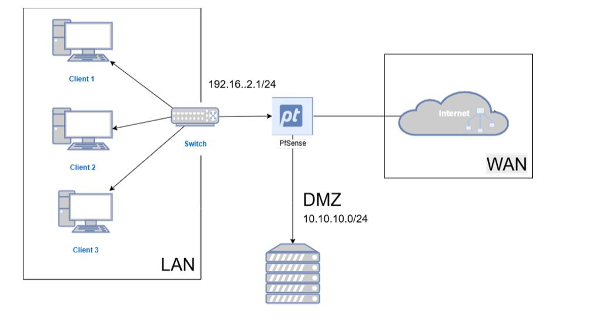
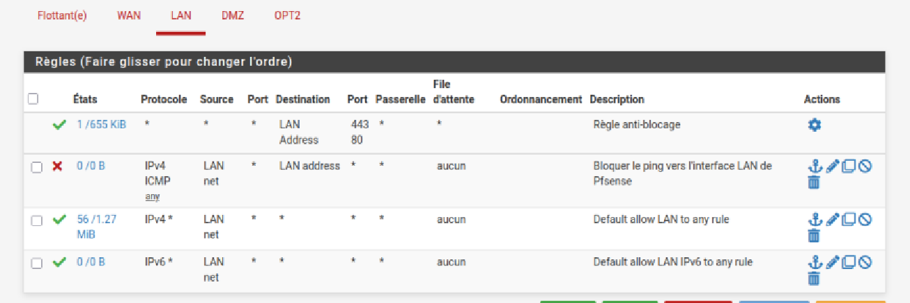
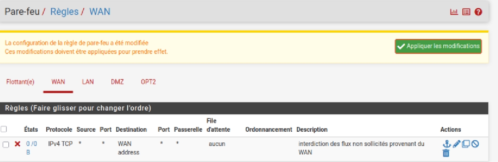
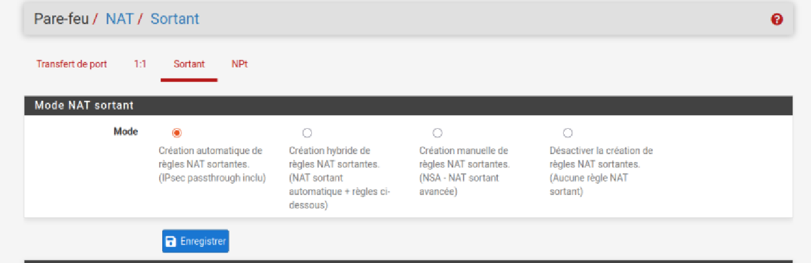
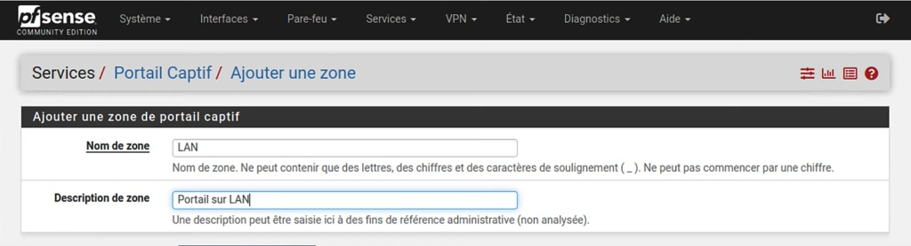
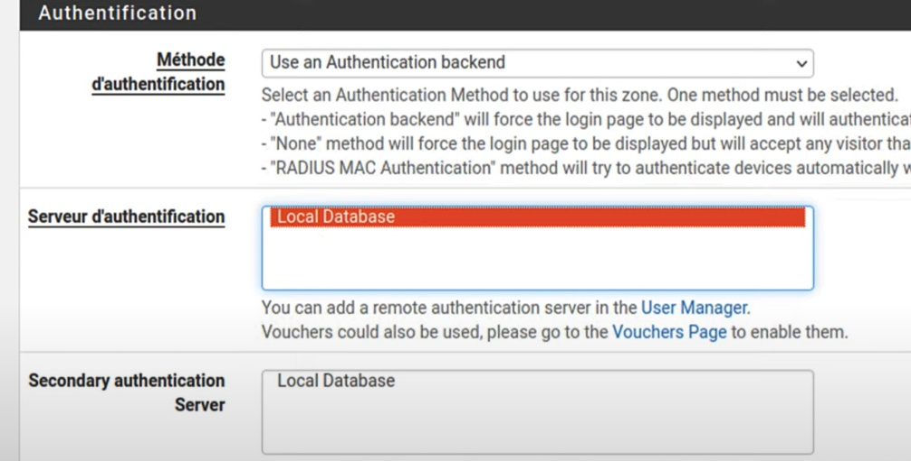
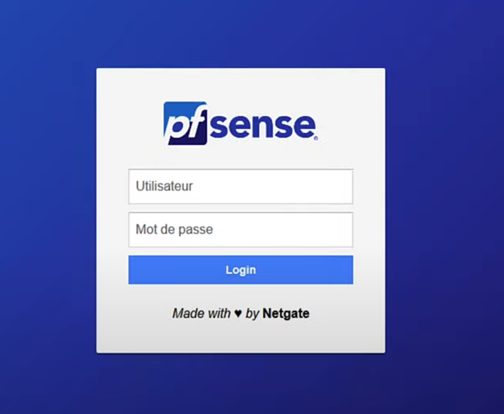

# Lab pfSense : pare-feu, segmentation LAN/DMZ et portail captif

Lab réalisé sous VirtualBox en première année du cycle ingénieur (ENSA Béni Mellal, filière Intelligence Artificielle et Cybersécurité). Il met en place un pare-feu **pfSense** qui segmente le réseau en trois zones (WAN, LAN, DMZ), filtre les flux et force les utilisateurs du LAN à s'authentifier via un **portail captif**.

## Objectifs

- Comprendre l'architecture d'un pare-feu et la segmentation réseau (WAN, LAN, DMZ)
- Écrire des règles de filtrage et configurer le NAT
- Contrôler l'accès au réseau avec un portail captif et une base d'utilisateurs locale

## Architecture

```
                         Internet (WAN, DHCP)
                                |
 Clients LAN ---- Switch ---- [ pfSense ] ---- DMZ (serveurs isolés)
 192.168.10.0/24                              10.10.10.0/24
```

| Zone | Interface | Adressage |
|---|---|---|
| WAN | em0 | DHCP (simule l'accès à Internet) |
| LAN | em1 | 192.168.10.1/24, serveur DHCP activé (plage 192.168.10.10 à 192.168.10.100) |
| DMZ | em2 | 10.10.10.1/24 |




## Environnement

- Hyperviseur : VirtualBox
- Pare-feu : pfSense 2.6.0 (machine virtuelle dédiée avec une carte réseau par zone)
- Client : machine virtuelle Ubuntu connectée au LAN, utilisée pour accéder à l'interface web (`https://192.168.10.1`) et tester le portail captif

## Règles de filtrage

| Interface | Règle | Objectif |
|---|---|---|
| WAN | Blocage des flux non sollicités | Aucune connexion entrante non autorisée depuis l'extérieur |
| LAN | Règle anti-blocage (accès à l'interface web de pfSense) | Garder l'accès à l'administration |
| LAN | Blocage du ping vers l'interface LAN de pfSense | Réduire l'exposition du pare-feu |
| LAN | Autorisation du trafic sortant vers Internet | Navigation des clients internes |
| DMZ | Blocage du trafic de la DMZ vers le LAN | Isoler la DMZ : un serveur compromis ne peut pas atteindre le réseau interne |

**NAT** : mode sortant automatique, pour que les machines internes accèdent à Internet avec une seule adresse publique.





## Portail captif

- Zone `LAN`, activée uniquement sur l'interface LAN (les flux WAN et DMZ ne sont pas concernés)
- Authentification : *Use an Authentication backend* avec la **base de données locale** de pfSense
- Un compte de test créé dans le gestionnaire d'utilisateurs, seuls les comptes activés peuvent se connecter
- Déroulement : le client est redirigé vers la page de connexion, saisit ses identifiants, puis l'accès est ouvert pour la durée de la session

Choix de la base locale : pas besoin de serveur d'authentification externe, ce qui convient à un réseau de petite taille ou à un lab.

*À COMPLÉTER : captures de la zone du portail, de l'authentification et de la page de connexion.*




## Tests réalisés

- *un client LAN sans authentification est redirigé vers le portail*
- *après connexion, le client accède à Internet*
- *un poste de la DMZ ne peut pas joindre le LAN*
- *le ping vers pfSense depuis le LAN est bloqué*

## Limites et améliorations possibles

Ce lab est une première version. Pistes d'amélioration :

- changer le mot de passe administrateur par défaut dès l'installation
- activer HTTPS sur le portail captif
- ajouter un système de détection d'intrusion (Suricata ou Snort)
- centraliser et analyser les journaux
- restreindre davantage les flux LAN vers la DMZ selon le principe du moindre privilège

## Remarque de sécurité

Ce dépôt ne contient aucune sauvegarde de configuration pfSense (`config.xml`) : ces fichiers contiennent des secrets (empreintes de mots de passe, certificats et clés privées) et ne doivent jamais être publiés.

## Auteure

**Sabrine Ouarchane**, élève ingénieure en IA et cybersécurité, ENSA Béni Mellal.
